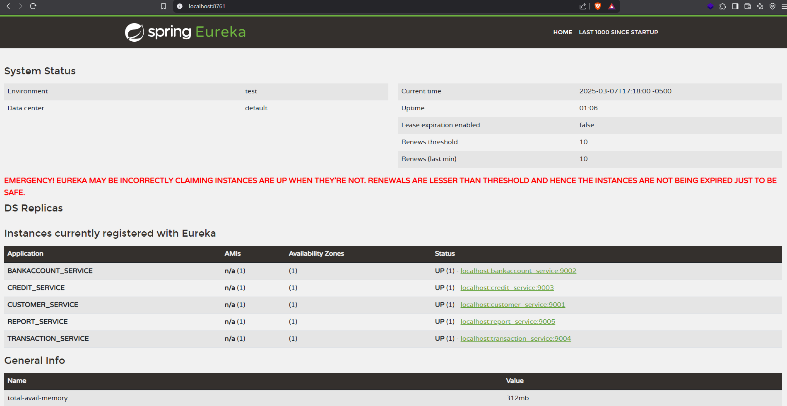

Project Spring Boot REST API
============================
This project is a simple REST API using Spring Boot. It is a simple project to demonstrate how to create a REST API using Spring Boot.

## Technologies
- Java 17
- Spring Boot 3.4.3
- Maven
- Lombok
- Swagger
- JUnit
- Mockito
- Spring Boot DevTools
- Spring Boot Starter Data JPA

